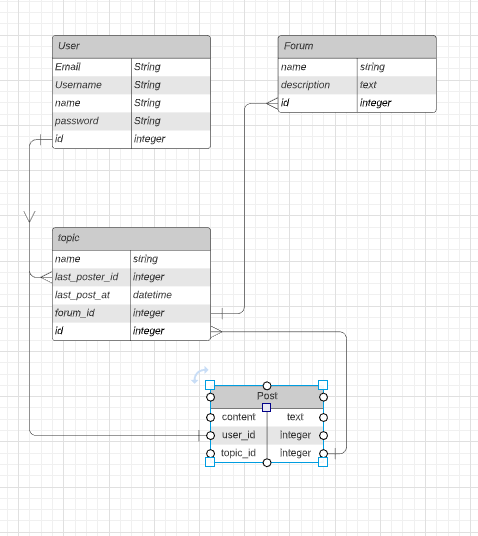
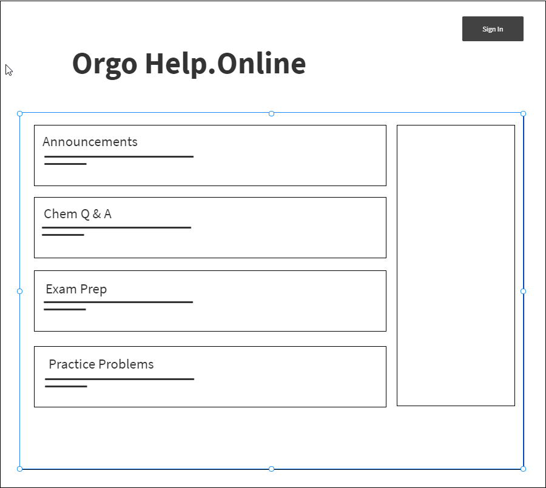
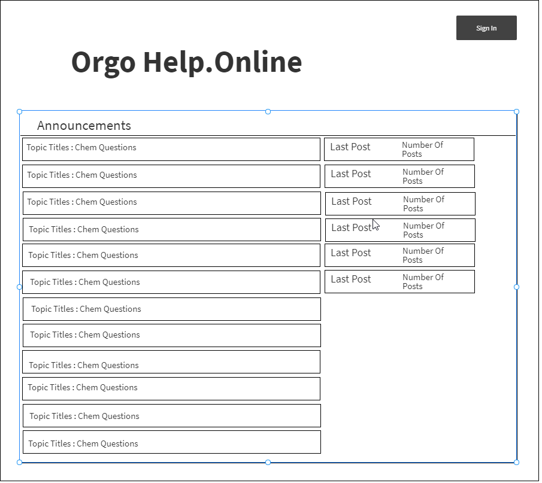

# Orgo Help.Online Forums & Practice Tests
## Author: Gabriel Romero

## Table of Contents
- [Description]
- [Stories & Wireframes]
- [Project Schedule]
- [Future Changes]

## Description
My partner is an Organic Chemistry Doctorate student and they work for a summer program which preps incoming students for college classes. She currently teaches Chemistry in the program and finds that students tend to have a hard time grasping the concepts and math side of chemistry. 

So I decided to set out and create a space where chemistry can be discussed and helped by those who know along with the ability to take practice tests. I wanted to keep it simple and build using rails. I aimed to keep it very simple and straight forward.

## Stories & Wireframes 
- Admins control forums and topics can edit delete and create
- User can sign up and can post topics in select forums
- Users will can take practice test and save their progress

## Models for DB

## Homepage

## Topics Page

